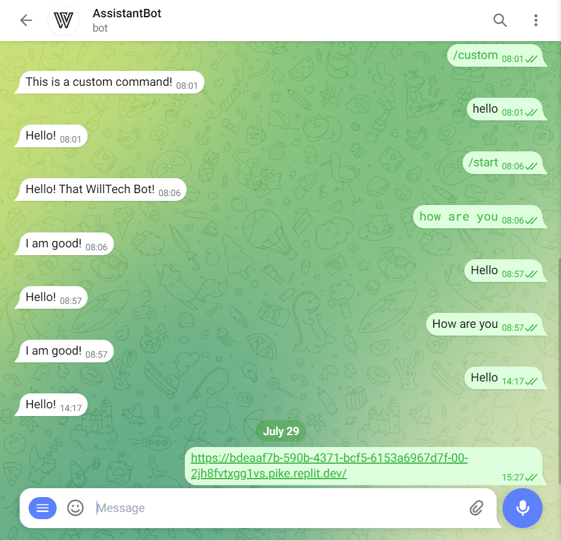
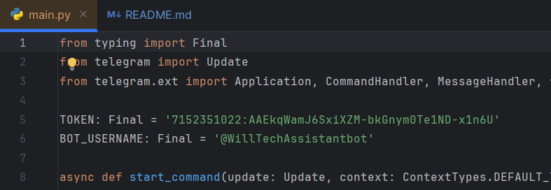

<h2>Telegram Bot</h2>
<h3>Простой макет бота для Телеграма</h3>

Для работы необходимо зарегестрировать собственного бота в BotFather 
После чего изменить значения  TOKEN и BOT_USERNAME на собственные.

Дальше запускаем main.py и бот начинает свою работу.